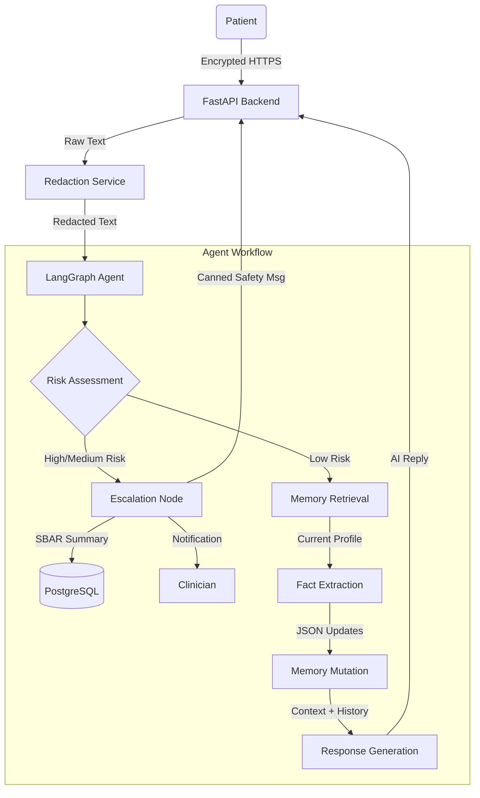

# Nightingale AI: Technical Brief

## 1. Architecture

The system is architected as a **Safety-First Agentic Workflow** wrapped in a modern PWA. Unlike generic chatbots, Nightingale prioritizes deterministic guardrails over generative freedom, implementing a "Risk-Gated" pipeline.

### High-Level Data Flow

### Key Components
1.  **FastAPI Backend**: Async Python server handling WebSocket/REST connections.
2.  **Redaction Layer**: Regular-expression based pre-processor that strips PII (Phone, Email, SSN) *before* any LLM processing.
3.  **LangGraph State Machine**: Orchestrates the agent nodes. Ensures dependencies (Memory must load before Fact Extraction) are strictly enforced.
4.  **Google Gemini 2.5 Pro**: The reasoning engine used for Risk Assessment, Fact Extraction, and Response Generation.

---

## 2. Data Schema & Relationships

The database schema (PostgreSQL) is designed for **provenance** and **auditability**. We do not simply store a "chat history"; we store a structured living profile where every fact is linked back to the conversation that created it.

### Core Entities

#### `User` & `PatientProfile`
- **One-to-One** relationship.
- `PatientProfile` stores medical data in structured JSONB columns (`medications`, `symptoms`, `conditions`).
- **Why JSONB?** Allows flexibility for diverse medical attributes (dosage, frequency, severity) without rigid relational schema migration overhead during prototyping.

#### `Conversation` & `Message`
- Standard One-to-Many chat log.
- **Voice Readiness**: The `Message` table includes `audio_url` and `transcription_id` columns, which are currently nullable but reserved for future voice storage.

#### `EscalationTicket`
- Created when Risk > LOW.
- Links `Patient` + `Conversation`.
- Stores generating `reason` (e.g., "Chest pain detected") and a generated `clinical_summary` (SBAR format).

---

## 3. Assumptions & First-Principles Thinking

### First Principles
1.  **Do No Harm (Safety > Utility)**: It is better to fail to answer a medical question than to answer it incorrectly or unsafe.
    *   *Implementation*: The `RiskNode` is a strict gatekeeper. If risk is high, the "Brain" (Response Node) is completely bypassed.
2.  **Privacy by Design**: PHI should never leave the secure boundary if possible.
    *   *Implementation*: Redaction happens at the edge (Service layer), not the Model layer. The LLM never sees the unredacted SSN.
3.  **Deterministic State**: Medical memory cannot be "fuzzy".
    *   *Implementation*: We use structured Fact Extraction (JSON output) rather than summarizing text blobs. A medication is either "Active" or "Stopped".

### Critical Assumptions
-   **User Truthfulness**: We assume the patient is reporting symptoms accurately. The system does not attempt to "detect lies," but rather tracks consistency via the profile.
-   **Clinician Availability**: The Escalation system assumes a human is available to review the queue. The system is not a replacement for 911/Emergency services (disclaimers required in UI).

---

## 4. Trade-offs & Scope

In building this prototype, several strategic cuts were made to prioritize core agentic safety.

| Feature | Included? | Rationale |
| :--- | :---: | :--- |
| **RBAC** | ✅ partial | Implemented basic Patient vs. Clinician roles. Strict ownership policies (Patient A accessing Patient B) are architected but requires middleware enforcement (see `test_access_control.py`). |
| **Real-time Voice** | ❌ NO | Complexity of WebSocket streaming + VAD (Voice Activity Detection) was high. **mitigation**: Schema is "Voice Ready" (see section 5). |
| **Vector Database** | ❌ NO | For a single patient profile, a structured JSON extraction is more precise than RAG (Retrieval Augmented Generation). RAG introduces "hallucination" risk for medical lookup. We chose precise JSON mutation instead. |
| **FHIR Interoperability** | ❌ NO | FHIR is verbose and complex. We used a simplified internal JSON schema for speed, with the assumption that a mapping layer would be added for EMR integration. |

---

## 5. VoiceAI Strategy

The requirement for "Voice Readiness" is met through a decoupled ingestion strategy. We do not need to rebuild the agent to add Voice; we simply change the **Input Channel**.

### Schema Support
We confirmed via `verifying_schema` task that `backend/models/message.py` supports:
-   `audio_url`: S3/Blob storage link to the raw audio file.
-   `transcription_id`: Link to the transcription job.

### Future Integration Plan
1.  **Client-Side**: PWA records audio blob.
2.  **Ingestion API**: `POST /api/v1/voice/upload` receives blob.
3.  **Transcriber**: Service (e.g., Google Deepgram/Whisper) converts Audio -> Text.
4.  **Injection**: The text is inserted into the `messages` table with `sender='PATIENT'` and the `audio_url` field populated.
5.  **Agent Trigger**: The existing LangGraph agent is triggered exactly as if it were a text message. The agent is agnostic to the input modality.

This separation of concerns ensures that the safety logic (Redaction/Risk) remains identical whether the input is typed or spoken.
